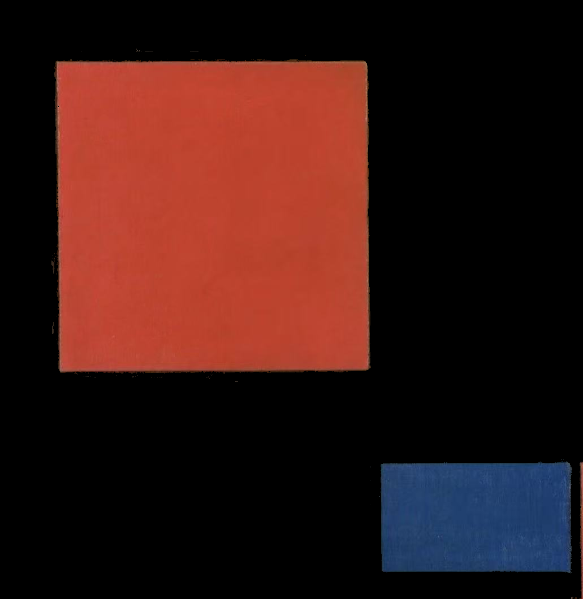
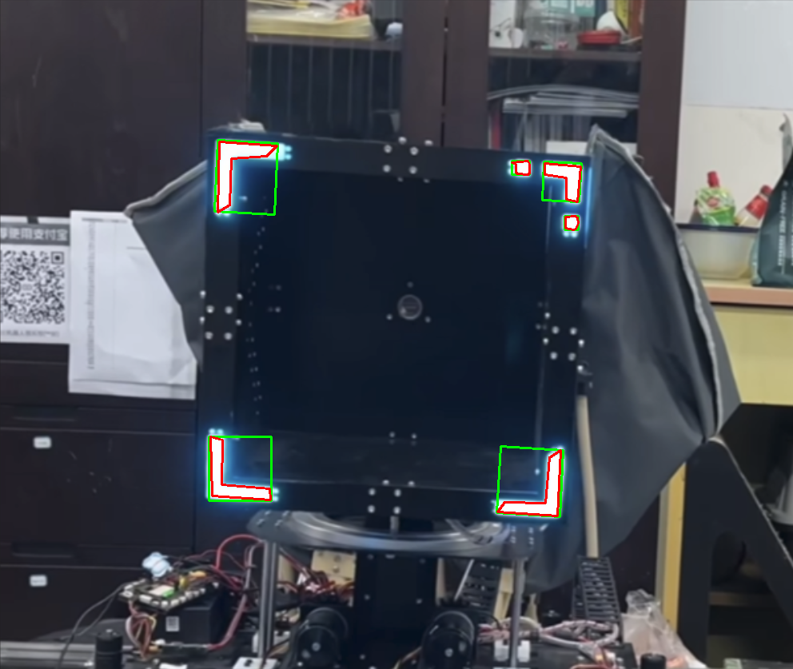

# 🎯 图像中指定颜色提取与几何拟合

这是一个基于 OpenCV 和 Python 实现的图像处理项目，包含两个主要功能模块：

1. **指定颜色提取**：通过 HSV 空间提取图像中的特定 RGB 颜色区域。
2. **形状分析处理**：对提取出的颜色区域进行最小外接矩形与多边形轮廓拟合。

适用于图像识别、图像分析、色彩检测等任务，可用于课程设计或实验项目。

---

## 📌 项目结构与功能

|    文件     | 功能描述                                   |
|------------------|----------------------------------------|
| `color_segmentation.py/` | 提取目标颜色区域，并输出掩码图与保留图 |
| `minAreaRect.py/`      | 对提取区域进行轮廓分析、最小矩形与多边形拟合 |
| `README.md`           | 本说明文件，包含安装、运行、注意事项等信息 |

---

## 🖼️ 示例图

### 🎨 颜色提取（黄色、红色、蓝色等）
<div align="center">
    
</div>

### 📐 几何拟合（最小外接矩形 + 多边形轮廓）
<div align="center">
    
</div>

---

## 🛠️ 使用方法

### 1. 安装依赖

确保已安装以下 Python 库：

```bash
pip install opencv-python numpy
```
### 2. 使用颜色提取模块
进入模块目录：

```bash
cd color_segmentation
python colorsegmentation.py
```
程序将读取 color_test.jpg，输出：

mask_output.png：颜色掩码图

result_output.png：颜色提取后的图像结果

可通过修改 target_color_rgb 设置提取颜色（RGB 格式）：

```
target_color_rgb = {
    (30,67,109),     # 蓝色
    ...
}
```
### 3. 使用几何拟合模块
确保 color_test.jpg 存在于 shape_fitting/ 目录下：

```
cd shape_fitting
python shape_fitting.py
```
输出文件：

fitted_result.png：绘制轮廓、矩形和多边形后的图像

fitted_mask.png：用于形状分析的掩码图
---
## 📂 文件说明
| 文件/文件夹名      | 说明                                  |
|------------------|----------------------------------------|
| `colorsegmentation.py`  | 颜色提取主程序 |
| `minAreaRect.py`  | 轮廓分析与图形拟合主程序 |
|`color_test.jpg`  | 输入图像，可替换 |
|`mask_output.png`  | 提取颜色的掩码图 |
| `result_output.png` | 提取颜色后的输出图像 |
| `white_corners.png` | 拟合形状后的图像（外接矩形 + 多边形） |
| `README.md` | 项目说明文件 |

